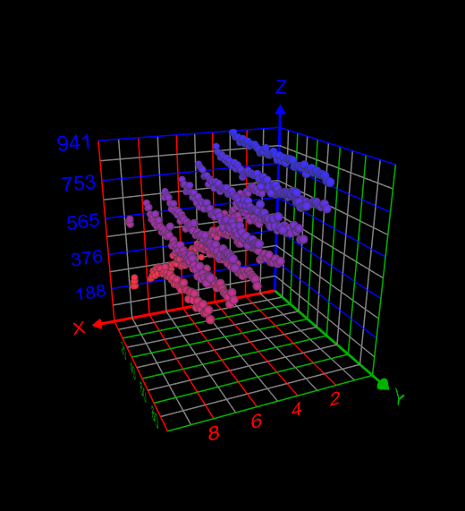
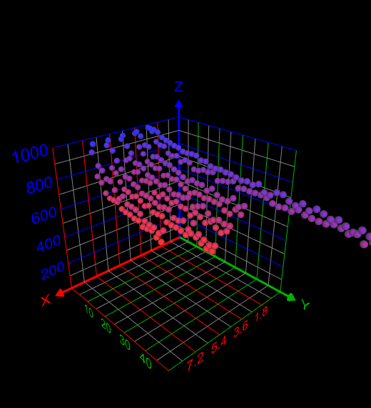

# Voting Theory Project 1

Created: Jan 18, 2021 4:15 PM

## Study Objective

This repository is created as part of Voting Theory study and consists of a Python module to study the properties of voting rules including the Copeland, Borda, and Plurality rule. The modules include the functions to model the election result of three rules, profile generator functions, and some helper functions and classes. The questions to answer include:

- How often does a Condorcet winner exist?
- How often does Borda choose the Condorcet winner?
- How often does Plurality choose the Condorcet winner?
- When the Condorcet winner does not exist, do Borda, plurality, and Copeland select the

    same alternative? How often do they coincide with each other?

## General Method of Study

To study the trend of the election result with different numbers of candidates(x) and voters(y), a thousand elections were conducted using an impartial culture to generate the preference profile. The range of data included the combinations of 3 to 9 candidates and 3 to 100 voters. Due to the computational limitations, some data lack part of the data in the range. All the computations were done on cloud using [AWS EC2](https://aws.amazon.com/jp/ec2/).

## Results

### **Q. How often does a Condorcet winner exist?**

- **Method:**

    Using the Copeland, the number of times in which the Condorcet winner was found in the profile (z), which is plotted in Plot 1 and 2 below.

- **Findings:**

    There are several clear trends in the frequency of Condorcet winners. The first one is the general decline trend of the frequency as the number of candidates (x) increases (Plot 1).

    Furthermore, there are distinct trends between when the number of voters is even and odd. When the number is even, the frequency of Condorcet winners was relatively lower while the odd number of voters yielded more Condorcet winners.

Plot 1: A general negative trend toward a larger number of candidates.

[https://lh5.googleusercontent.com/LPJbDWqietiBzx7n1VXvIyYdrMmuXVT4GEnmBXhsEyPAxAHmww8S3omjdhyBOuPsw01SSy4XS4gLg2QrXz2DynM9jLSboT-fJ7WromyrC5jxyqeBj_5JO6dakc5fQJU_ctypc_mk](https://lh5.googleusercontent.com/LPJbDWqietiBzx7n1VXvIyYdrMmuXVT4GEnmBXhsEyPAxAHmww8S3omjdhyBOuPsw01SSy4XS4gLg2QrXz2DynM9jLSboT-fJ7WromyrC5jxyqeBj_5JO6dakc5fQJU_ctypc_mk)

Plot 2: Sideway view of Plot 1. Clear distinct trends between even (lower cluster) and odd (higher cluster) numbers of voters.

### **Q2.  How often does Borda choose the Condorcet winner?**

- **Method**:

    Given only the profiles that contain Condorcet winner, the number of times Borda rule chose the Condorcet winner was counted out of a thousand profiles (z).

- **Findings:**

    Borda rule constantly elected the Condorcet winner approximately 85-95% of the time. A slight negative trend was observed as both the number of candidates and voters increased (Plot 3).

[https://lh6.googleusercontent.com/GTi9qbNi9PADsWI02W88ouGeIi-JGYBd79VuZ0n3Y1GXjl1-OxBkG__ZhlTaIC1UAmP1uV8bKjIQa3tZnkQDT_8uqNoirl1chwPsASNjp6WSuogE-3BAdy4ybEgPSEJTZ3HF99hk](https://lh6.googleusercontent.com/GTi9qbNi9PADsWI02W88ouGeIi-JGYBd79VuZ0n3Y1GXjl1-OxBkG__ZhlTaIC1UAmP1uV8bKjIQa3tZnkQDT_8uqNoirl1chwPsASNjp6WSuogE-3BAdy4ybEgPSEJTZ3HF99hk)

Plot 3: A generally constant nomination of the Condorcet winner by Borda.

### Q3. How often does Plurality choose the Condorcet winner?

- **Method:**

    Given only the profiles that contain Condorcet winner, the number of times Plurality rule chose the Condorcet winner was counted out of a thousand profiles (z).

- **Findings:**
It can be said that more than half of the time, the Plurality rule chooses the Condorcet winner, usually between 60 to 90%. The rate decreases as the numbers of candidates and voters increase (Plot 4).

Plot 4: A negative trend in choosing the Condorcet winner as the numbers of candidates and voters increase

### Q4. When the Condorcet winner does not exist, do Borda, plurality, and Copeland select the same alternative? How often do they coincide with each other?

- **Method:**

    For a thousand profiles, Copeland, Borda, and Plurality rule chose the winner(s). For each profile, the number of times was counted when 1) Copeland and Plurality, 2) Borda and Plurality, 3) Copeland and Borda, 4) all rules matched their result.

- **Findings:**

    **1) Copeland and Plurality match:**

    Generally, the number of their match is low between 100 to 300. Within the dataset, the matching rate is relatively high when both the numbers of candidates and voters are low. An interesting finding was that when there are three candidates and a prime number of voters, then these two rules never match their result.

    **2) Borda and Plurality match:**

    The number of their match seems to stay relatively constant when there is the same number of candidates regardless of the number of voters. There is also a negative trend as the number of candidates increases (Plot 6).

    **3) Copeland and Plurality match:**

    The number of their matches increases as the number of candidates increases and decreases as the number of voters decreases (Plot 7).

    **4) All rules match:**

    The number of their matches is constantly low between 0 to 150. The results of the three rules agreed the most when there are both low numbers of candidates and voters (Plot 8).

[https://lh4.googleusercontent.com/AkvZg2i0TYrXZxcGDPGJ3FH8Fa7ylZfg9fPE6PWeH0Ivh08lf86NK34LzBF5i5SDfJQDR9V6BlK5UtJ8P81Qipo1A3Up4V9y82Fne9dAVQYBUMf_Zn8tFXd_eXsHzp68fILA5dto](https://lh4.googleusercontent.com/AkvZg2i0TYrXZxcGDPGJ3FH8Fa7ylZfg9fPE6PWeH0Ivh08lf86NK34LzBF5i5SDfJQDR9V6BlK5UtJ8P81Qipo1A3Up4V9y82Fne9dAVQYBUMf_Zn8tFXd_eXsHzp68fILA5dto)

[https://lh6.googleusercontent.com/ApDl9_B_iOkmZsPu4UBBE_ZMEws6GGhSt_XAgx0bWHsS3-PyMxTPtkkjXkJQimoHM6gXfdcXP8SnBd7Yr947vLkNhAhWBVtDVccJ3lGjEZVeghccoH5aElmEmO3gtCbVItEbwFDp](https://lh6.googleusercontent.com/ApDl9_B_iOkmZsPu4UBBE_ZMEws6GGhSt_XAgx0bWHsS3-PyMxTPtkkjXkJQimoHM6gXfdcXP8SnBd7Yr947vLkNhAhWBVtDVccJ3lGjEZVeghccoH5aElmEmO3gtCbVItEbwFDp)

Plot 6: A negative trend as the number of candidate increases.

[https://lh3.googleusercontent.com/u1RkDDVBGSMX22sxCPBwMjafZ4uCLPUAt_jkZ2WpZ-Je5W4H01valUVco55nOhoujy4-LdRtHVhO-Vq2f-1YyD9MpOwZ4tghaFeS00oRQxZG4k1cyID7t-svQusCy6F-hXr0RX_V](https://lh3.googleusercontent.com/u1RkDDVBGSMX22sxCPBwMjafZ4uCLPUAt_jkZ2WpZ-Je5W4H01valUVco55nOhoujy4-LdRtHVhO-Vq2f-1YyD9MpOwZ4tghaFeS00oRQxZG4k1cyID7t-svQusCy6F-hXr0RX_V)

Plot 7: Relatively A positive trend as the number of candidate increases and a negative trend as the number of voters decreases.

[https://lh6.googleusercontent.com/ojx2L2sy1zFT7mret04MtvKm4iTR5DZbabfhY4CkRWaUJ4LpLCd1_kXy2BVcsdoxsVfDAccwS2Tp3tVmeL8jcwjtXRmnywvHw9frgS1DgkIEbHF-BmWsrn2W0hH2dYchmSbDsSyW](https://lh6.googleusercontent.com/ojx2L2sy1zFT7mret04MtvKm4iTR5DZbabfhY4CkRWaUJ4LpLCd1_kXy2BVcsdoxsVfDAccwS2Tp3tVmeL8jcwjtXRmnywvHw9frgS1DgkIEbHF-BmWsrn2W0hH2dYchmSbDsSyW)

Plot 8: A relatively constant trend except for when there are both fewer candidates and voters.
